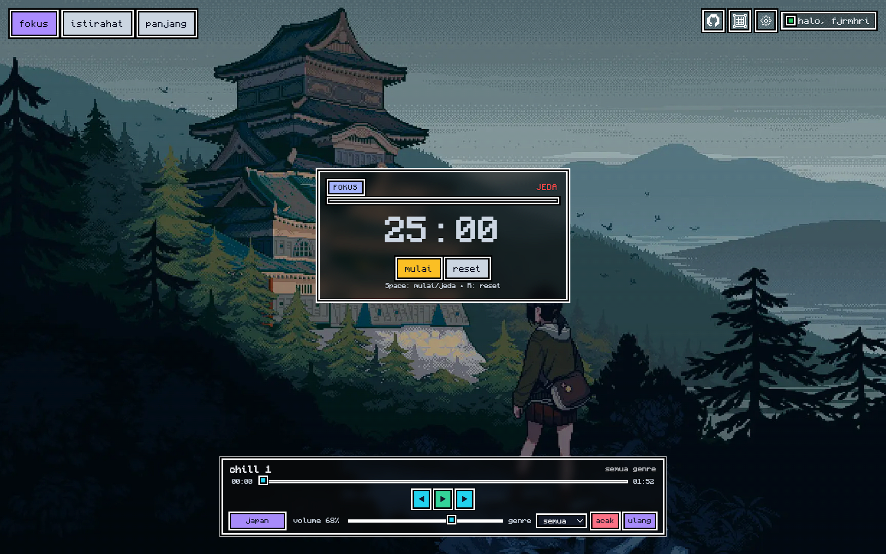

<p align="center">
  
  
  
  
  
</p>

# 🎧✨ Proyek Website Pomodoro Timer dan Pemutar Musik Lofi Interaktif

## 📝 Deskripsi Proyek

**Pomo-Pixel** adalah aplikasi web pomodoro timer + pemutar musik lofi interaktif yang menghadirkan suasana fokus dan santai. Dibangun dengan Next.js dan Tailwind CSS, aplikasi ini memadukan musik, wallpaper dinamis, dan efek atmosfer untuk menemani sesi belajar maupun kerja.

Fitur utama:

- ⏳ **Pomodoro timer** meningkatkan fokus dan produktivitas
- 🎵 Pemutar musik **lofi** dengan koleksi track _chill_, _jazzy_, dan _sleepy_
- 🌌 **Live wallpaper** bergaya Pixel yang bisa diganti sesuai mood

> Dibuat untuk menemani kamu belajar, bekerja, atau sekadar bersantai. 🌙🍵

---

## 🖼️ Preview Gambar



---

## 🛠️ Tech Stack

- ⚡ **Next.js** – Framework React modern
- 🎨 **Tailwind CSS** – Styling cepat & responsif
- 🔥 **Firebase** – Backend untuk autentikasi dan penyimpanan data
- 🎵 **HTML5 Audio** – Pemutar musik & efek suara
- 🎥 **Custom Overlay Video** – Efek atmosfer transparan
- 🌄 **Image & GIF Assets** – Wallpaper

---

## 🚀 Cara Memulai Proyek

### 1️⃣ Instal Dependensi

Jalankan salah satu perintah berikut:

```bash
npm install
# atau
yarn install
# atau
pnpm install
# atau
bun install

```

### 2️⃣ Buat File .env.local di Root

Berikut isi file:

```bash
NEXT_PUBLIC_FIREBASE_API_KEY=your-api-key
NEXT_PUBLIC_FIREBASE_AUTH_DOMAIN=your-auth-domain
NEXT_PUBLIC_FIREBASE_PROJECT_ID=your-project-id
NEXT_PUBLIC_FIREBASE_STORAGE_BUCKET=your-storage-bucket
NEXT_PUBLIC_FIREBASE_MESSAGING_SENDER_ID=your-messaging-sender-id
NEXT_PUBLIC_FIREBASE_APP_ID=your-app-id
NEXT_PUBLIC_FIREBASE_MEASUREMENT_ID=your-measurement-id

```

### 3️⃣ Jalankan Server Pengembangan

```bash
npm run dev
# atau
yarn dev
# atau
pnpm dev
# atau
bun dev

```

### 4️⃣ Buka di Browser

Akses aplikasi di: 👉 http://localhost:3000

File utama untuk mulai eksplorasi: app/page.js
Setiap perubahan tersimpan akan otomatis merefresh browser.

## 📚 Resources dan Kredit

- 🎶 Musik: [ItzAshOffcl/lofi-resources](https://github.com/ItzAshOffcl/lofi-resources)
- 🖼️ Wallpaper & inspirasi kode: [DerickPascual/pomodoros](https://github.com/DerickPascual/pomodoros)

## 📖 Pelajari Lebih Lanjut

- 📚 [Next.js Documentation](https://nextjs.org/docs) – Fitur & API lengkap
- 🧑‍💻 [Learn Next.js](https://nextjs.org/learn) – Tutorial interaktif resmi

✨ Nikmati vibes lofi, biarkan musik menemani aktivitasmu 🎶☕🌙
